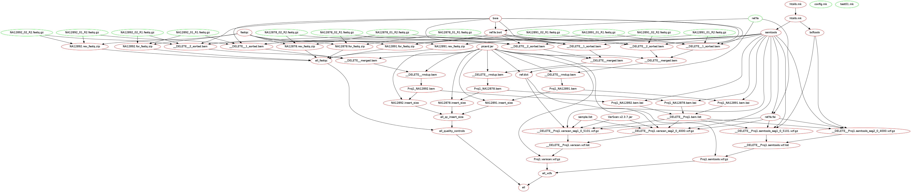

## Motivation

build a simple Makefile-based workflow for Next Generation Sequencing with a **XML** model and a **XSLT** transformation.

Generating the Makefile only requires standard tools like **xmllint** and **xsltproc**.

To test this worklow, just type

```
$ make
```

it will generate and run a new makefile for the model below. 

## Example

Here is an self-explanatory example of model for the data

```xml
<?xml version="1.0" encoding="UTF-8"?>
<model name="myProject" description="my project" directory="OUT">
  <project name="Proj1">
    <sample name="NA12878">
      <fastq>
        <for>test/fastq/NA12878_01_R1.fastq.gz</for>
        <rev>test/fastq/NA12878_01_R2.fastq.gz</rev>
      </fastq>
      <fastq id="groupid2" lane="2" library="lib1" platform="ILMN" median-size="98">
        <for>test/fastq/NA12878_02_R1.fastq.gz</for>
        <rev>test/fastq/NA12878_02_R2.fastq.gz</rev>
      </fastq>
    </sample>
    <sample name="NA12891">
      <fastq>
        <for>test/fastq/NA12891_01_R1.fastq.gz</for>
        <rev>test/fastq/NA12891_01_R2.fastq.gz</rev>
      </fastq>
      <fastq>
        <for>test/fastq/NA12891_02_R1.fastq.gz</for>
        <rev>test/fastq/NA12891_02_R2.fastq.gz</rev>
      </fastq>
    </sample>
    <sample name="NA12892">
      <fastq>
        <for>test/fastq/NA12892_01_R1.fastq.gz</for>
        <rev>test/fastq/NA12892_01_R2.fastq.gz</rev>
      </fastq>
      <fastq>
        <for>test/fastq/NA12892_02_R1.fastq.gz</for>
        <rev>test/fastq/NA12892_02_R2.fastq.gz</rev>
      </fastq>
    </sample>
  </project>

  <segments xml:base="ref/segments.xml">
    <segment chrom="seg1" start="0" end="5101"/>
    <segment chrom="seg2" start="0" end="4000"/>
  </segments>

</model>

```

Process the XML-model with the xslt stylesheet and create a **Makefile**

```bash
$ xsltproc --output makefile stylesheets/model2make.xsl test/model01.xml
```

Here is the generated **makefile**: [makefile.md](https://github.com/lindenb/ngsxml/blob/master/makefile.md)

```make
include config.mk
OUTDIR=OUT
(...)

.PHONY=all clean all_bams all_vcfs
all_qc_insert_size :  \
	$(call project_dir,Proj1)/Samples/NA12878/SIZE/NA12878.insert_size \
	$(call project_dir,Proj1)/Samples/NA12891/SIZE/NA12891.insert_size \
	$(call project_dir,Proj1)/Samples/NA12892/SIZE/NA12892.insert_size


all_bams:  \
	$(call project_dir,Proj1)/Samples/NA12878/BAM/Proj1_NA12878.bam \
	$(call project_dir,Proj1)/Samples/NA12891/BAM/Proj1_NA12891.bam \
	$(call project_dir,Proj1)/Samples/NA12892/BAM/Proj1_NA12892.bam

$(eval $(foreach C,${callers},$(call gather_vcf,Proj1,$C)))
$(eval $(foreach C,${callers},$(call create_vcf_list,Proj1,$C)))


#
# Create a VCF  for project '' and segment 
#

$(call  vcf_segment,Proj1,samtools,seg1,0,5101) : $(call project_dir,Proj1)/BAM/${tmp.prefix}Proj1.bam.list \
	$(addsuffix .fai,${REFERENCE}) ${samtools.exe}  ${bcftools.exe}
	mkdir -p $(dir $@) && \
	${samtools.exe} mpileup -uf ${REFERENCE} -b $< -r seg1:0-5101 | \
	${bcftools.exe} call  --variants-only --multiallelic-caller --output-type z --output $@


(...)
```

This Makefile **includes** an external file 'config.mk' describing the reference, the path of the tools.
```make
REFERENCE=test/ref/ref.fa
tmp.prefix=__DELETE__
samtools.exe=samtools
bcftools.exe=bcftools
bgzip.exe=bgzip
tabix.exe=tabix
bwa.exe=bwa
```

Using the option `-I` of `make` allows to select an alternate path to  config.mk. 


Here is the workflow visualized with https://github.com/lindenb/makefile2graph




run the makefile, with 5 parallel jobs, set the path to config.mk with option `-I`

```bash
$ make -j5 -f makefile -I test/config/01/


mkdir -p OUT/Projects/Proj1/Samples/Sample1/BAM/ && \
	bwa mem -R '@RG\tID:idp4617012\tSM:Sample1' test/ref/ref.fa test/fastq/sample_1_01_R1.fastq.gz test/fastq/sample_1_01_R2.fastq.gz  |\
	samtools view -uS - |\
	samtools sort - OUT/Projects/Proj1/Samples/Sample1/BAM/__DELETE__1_sorted 
mkdir -p OUT/Projects/Proj1/Samples/Sample1/BAM/ && \
	bwa mem -R '@RG\tID:idp4617668\tSM:Sample1' test/ref/ref.fa test/fastq/sample_1_02_R1.fastq.gz test/fastq/sample_1_02_R2.fastq.gz  |\
	samtools view -uS - |\
	samtools sort - OUT/Projects/Proj1/Samples/Sample1/BAM/__DELETE__2_sorted 
mkdir -p OUT/Projects/Proj1/Samples/Sample1/BAM/ && \
 	samtools merge -f OUT/Projects/Proj1/Samples/Sample1/BAM/__DELETE__merged.bam OUT/Projects/Proj1/Samples/Sample1/BAM/__DELETE__1_sorted.bam OUT/Projects/Proj1/Samples/Sample1/BAM/__DELETE__2_sorted.bam
mkdir -p OUT/Projects/Proj1/Samples/Sample1/BAM/ && \
	samtools rmdup  OUT/Projects/Proj1/Samples/Sample1/BAM/__DELETE__merged.bam  OUT/Projects/Proj1/Samples/Sample1/BAM/__DELETE__rmdup.bam
mkdir -p OUT/Projects/Proj1/Samples/Sample1/BAM/ && \
	cp  OUT/Projects/Proj1/Samples/Sample1/BAM/__DELETE__rmdup.bam OUT/Projects/Proj1/Samples/Sample1/BAM/Proj1_Sample1.bam
mkdir -p OUT/Projects/Proj1/Samples/Sample2/BAM/ && \
	bwa mem -R '@RG\tID:idp4618636\tSM:Sample2' test/ref/ref.fa test/fastq/sample_2_01_R1.fastq.gz test/fastq/sample_2_01_R2.fastq.gz  |\
	samtools view -uS - |\
	samtools sort - OUT/Projects/Proj1/Samples/Sample2/BAM/__DELETE__1_sorted 
mkdir -p OUT/Projects/Proj1/Samples/Sample2/BAM/ && \
	samtools rmdup  OUT/Projects/Proj1/Samples/Sample2/BAM/__DELETE__1_sorted.bam  OUT/Projects/Proj1/Samples/Sample2/BAM/__DELETE__rmdup.bam
mkdir -p OUT/Projects/Proj1/Samples/Sample2/BAM/ && \
	cp  OUT/Projects/Proj1/Samples/Sample2/BAM/__DELETE__rmdup.bam OUT/Projects/Proj1/Samples/Sample2/BAM/Proj1_Sample2.bam
mkdir -p OUT/Projects/Proj1/VCF/ && \
	samtools mpileup -uf test/ref/ref.fa OUT/Projects/Proj1/Samples/Sample1/BAM/Proj1_Sample1.bam OUT/Projects/Proj1/Samples/Sample2/BAM/Proj1_Sample2.bam | \
	bcftools view -vcg - > OUT/Projects/Proj1/VCF/Proj1.vcf  && \
	bgzip -f OUT/Projects/Proj1/VCF/Proj1.vcf && \
	tabix -f -p vcf OUT/Projects/Proj1/VCF/Proj1.vcf.gz
```

A set of tabix-indexed VCF are produced at the end (samtools, freebayes... ):

```
$ gunzip -c OUT/Projects/Proj1/VCF/samtools/Proj1.samtools.vcf.gz
##fileformat=VCFv4.1
##samtoolsVersion=0.1.19-44428cd
##reference=file://test/ref/ref.fa
(...)
#CHROM	POS	ID	REF	ALT	QUAL	FILTER	INFO	FORMAT	Sample1	Sample2
chr4_gl000194_random	1973	.	C	G	14.4	.	DP=3;VDB=2.063840e-02;AF1=1;AC1=4;DP4=0,0,3,0;MQ=60;FQ=-32.3	GT:PL:GQ	1/1:31,6,0:11	1/1:17,3,0:8
chr4_gl000194_random	2462	.	A	T	14.4	.	DP=3;VDB=2.063840e-02;AF1=1;AC1=4;DP4=0,0,0,3;MQ=60;FQ=-32.3	GT:PL:GQ	1/1:31,6,0:11	1/1:17,3,0:8
chr4_gl000194_random	2492	.	G	C	14.4	.	DP=3;VDB=2.063840e-02;AF1=1;AC1=4;DP4=0,0,0,3;MQ=60;FQ=-32.3	GT:PL:GQ	1/1:31,6,0:11	1/1:17,3,0:8
chr4_gl000194_random	2504	.	A	T	14.4	.	DP=3;VDB=2.063840e-02;AF1=1;AC1=4;DP4=0,0,0,3;MQ=60;FQ=-32.3	GT:PL:GQ	1/1:31,6,0:11	1/1:17,3,0:8
chr4_gl000194_random	6652	.	A	C	14.4	.	DP=3;VDB=2.063840e-02;AF1=1;AC1=4;DP4=0,0,3,0;MQ=60;FQ=-32.3	GT:PL:GQ	1/1:31,6,0:11	1/1:17,3,0:8
(...)
```

## Author

Author: Pierre Lindenbaum PhD

## Contribute

- Issue Tracker: http://github.com/lindenb/ngsxml/issues
- Source Code: http://github.com/lindenb/ngsxml


##History

* 2015-03-11 : added support for freebayes and varscan; added FASTQC and CollectInsertSizeMetrics
* 2015-03-10 : using sources from htslib+github
* 2015-03-03 : added segments to split mpileup by regions, picard 1.129, bam-list and vcf-list
* 2015-02-19 : added compatibility with our cluster (no newlines), graph target
* 2015 : Creation

## License

The project is licensed under the MIT license.

twitter @yokofakun


